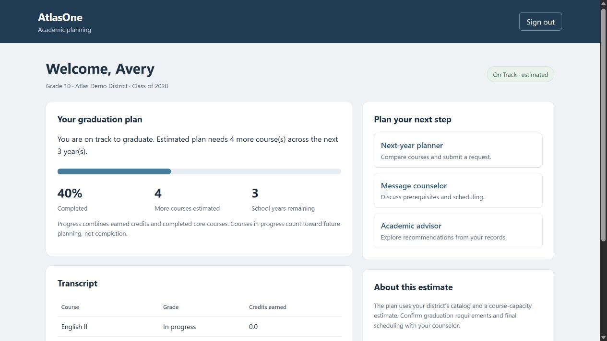

# AtlasOne

A Django academic-planning prototype for students, counselors, and families. Students see graduation progress and request courses; counselors review requests and maintain transcripts; parents see only students linked to their account.

The demo uses fictional records and runs locally without an API key. Optional Gemini integration adds conversational explanations and speech. Graduation calculations and prerequisite checks run in Python, independently of the language model.



## Try it locally

Requires Python 3.12–3.14 and Git. Python 3.14 is the locally verified version; CI also targets 3.12.

Clone this repository, open its directory, then create an environment:

```powershell
# Windows PowerShell
py -3.14 -m venv .venv
.\.venv\Scripts\Activate.ps1
python -m pip install --upgrade pip
python -m pip install -r requirements-dev.txt
Copy-Item .env.example .env
```

```bash
# macOS / Linux
python3 -m venv .venv
source .venv/bin/activate
python -m pip install --upgrade pip
python -m pip install -r requirements-dev.txt
cp .env.example .env
```

Generate a local signing key:

```bash
python -c "import secrets; print(secrets.token_urlsafe(50))"
```

Paste that value after `DJANGO_SECRET_KEY=` in `.env`. Keep the key local. The example selects `demo.sqlite3`, so the demo does not use an existing `db.sqlite3`. Existing environment variables take precedence over `.env`.

```bash
python manage.py migrate
python manage.py seed_demo
python manage.py runserver
```

Open [localhost:8000](http://127.0.0.1:8000). All three fictional accounts use the local-only password `AtlasDemo!2026`:

| Account | What to explore |
| --- | --- |
| `demo.student` | Graduation progress, conditional prerequisites, course requests |
| `demo.counselor` | Pending requests, transcript entry, student messaging |
| `demo.parent` | Linked student's progress and family-facing explanations |

`seed_demo` refuses production mode and an existing non-demo database. Running it again preserves the demo's records and passwords. It creates no administrator account.

## A three-minute walkthrough

1. Sign in as the student. Geometry is **in progress**, so it does not count as completed credit.
2. Open the planner. Algebra II depends on passing Geometry; its pending request is already seeded. Request Chemistry, whose Biology prerequisite is complete.
3. Sign out and sign in as the counselor. Review the request, add a note, and inspect the student's transcript.
4. Sign in as the parent. Only the explicitly linked student is visible. Open the advisor for a local summary.

[Planner screenshot](docs/screenshots/planner.png) · [Counselor screenshot](docs/screenshots/counselor-dashboard.png) · [Parent screenshot](docs/screenshots/parent-dashboard.png)

## How it works

- **Access rules:** `Pathway/access.py` scopes students and conversations before records are fetched. Counselors see their district or explicit assignments. Parent access requires a current link.
- **Academic policy:** `services/academic_policy.py` is the shared passing/in-progress policy. The planner permits conditional next-year requests; the advisor distinguishes these from immediately eligible courses.
- **Graduation estimate:** `services/graduation.py` combines subject-credit gaps, required courses, prerequisite traversal, and a heuristic capacity estimate.
- **AI boundary:** `services/snapshot.py` builds academic context. `services/gemini.py` handles HTTP, response-size limits, and speech conversion.
- **HTTP and forms:** `views/` is grouped by workflow. Django forms validate signup, transcripts, and messages; multi-record signup and transcript imports use transactions.

See [architecture and tradeoffs](docs/architecture.md) for the assumptions behind these choices.

## Verification

```bash
python -m ruff check .
python -m ruff format --check .
python manage.py check
python manage.py makemigrations --check --dry-run
python -m coverage run manage.py test
python -m coverage report
python -m pip_audit --local
python scripts/check_publication.py
```

GitHub Actions runs lint, formatting, tests, migration checks, demo setup, static collection, production-setting checks, and dependency auditing. The workflow uses read-only permissions and pinned action commits. Dependabot checks Python dependencies and Actions weekly.

Direct dependencies are pinned in `requirements.txt`; `constraints.txt` records the verified runtime dependency set. Update related pins together and rerun the checks.

## Optional Gemini setup

Keep `AI_ENABLED=False` for the offline demo. To exercise the provider integration, set `AI_ENABLED=True` and supply `GEMINI_API_KEY` in the local environment. Model names are configurable through `GEMINI_MODEL` and `GEMINI_TTS_MODEL`.

Enabling this sends academic context and messages to Google. Use fictional data. Provider credentials, availability, translation quality, and speech generation are not verified by the offline test suite; HTTP interactions are mocked. Text errors fall back to local recommendations.

If an attempted advisor request fails, that reply gets an "AI service unavailable" notice. Successful replies, deliberately disabled AI, and a missing API key do not trigger this failure notice. Speech failures are reported separately from text-generation failures. The notice is rendered in the browser from an `api_failed` response flag, never appended to the answer or sent in Gemini's conversation context. 

The explicit connection test `python -m Pathway.utils.api_tester` makes a provider request using a generic prompt with no student records. It may consume quota.

## Scope and limitations

This is a portfolio prototype, not a school deployment. It has no verified invitation workflow, distributed rate limiting, background job queue, or audit trail. SQLite is the default. Credits use legacy floating-point fields; repeated transcript rows and district-specific repeat-credit rules need further modeling. The graduation engine estimates feasibility; it is not an optimal timetable solver.

Parent and counselor accounts must be provisioned by staff. For manual local administration, create a superuser with `python manage.py createsuperuser`, then create a User and its role profile through `/admin/`. Link parents and assign counselors explicitly.

PDF import supports a particular five-column table layout, not arbitrary transcripts or OCR. Its size/page limits do not make parsing untrusted documents safe for public hosting.

Read [security and known limitations](SECURITY.md).
